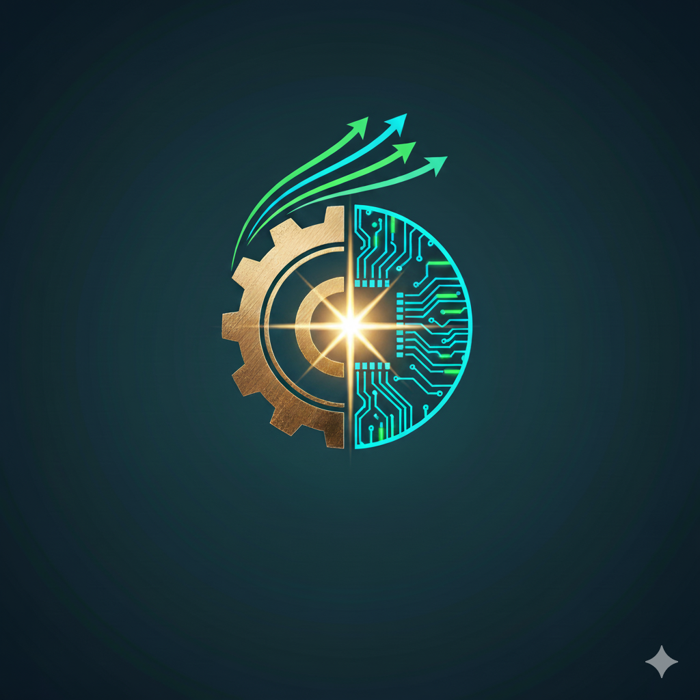

# 毛泽东思想学习平台

<div align="center">



**学习毛泽东思想，传承红色基因**

一个集知识学习、互动体验、创作分享于一体的综合性红色教育平台

</div>

---

## 🎯 项目简介

本项目是一个围绕"毛泽东思想"主题构建的多维度、交互式学习平台，通过现代化的Web技术，将红色文化教育与互动体验相结合，让学习变得更加生动有趣。

### 核心功能

| 模块 | 功能描述 |
|------|----------|
| 🤖 **智能问答** | 基于AI的毛泽东思想知识问答助手 |
| 🎮 **互动学习** | 答题挑战、历史人物对话、趣味射击游戏 |
| 🏛️ **3D展馆** | 革命历史文物三维模型展示 |
| 📝 **创作竞赛** | 作品投稿、投票评选、作品展示 |
| 📅 **历史上的今天** | 每日历史事件自动展示 |
| 💬 **讨论区** | 主题讨论、发帖评论、点赞互动 |
| 📚 **知识分享** | 时间轴形式的历史节点回顾 |

---

## 🚀 快速开始

### 环境要求

- Node.js ≥ 16
- npm ≥ 7
- 现代浏览器（Chrome/Firefox/Edge）

### 一键启动（Windows）

```bash
双击运行：管理.bat
```

或手动启动：

```bash
cd server
npm install
npm start
```

访问：`http://localhost:3000`

### 默认账号

- **管理员**：账号 `佟雨泽`，密码 `20050812`

---

## 📁 项目结构

```
Share_Web/
├── server/                 # 后端服务
│   ├── index.js           # 服务入口
│   ├── package.json       # 依赖配置
│   └── *.json             # 数据文件
├── index.html             # 主页
├── ai.html                # 智能问答
├── challenge.html         # 互动学习
├── game.html              # 射击游戏
├── models.html            # 3D展馆
├── contest.html           # 创作竞赛
├── knowledge.html         # 知识分享
├── discuss.html           # 讨论区
├── profile.html           # 个人中心
├── style.css              # 全局样式
├── main.js                # 通用脚本
├── images/                # 图片资源
├── audio/                 # 音频资源
└── docs/                  # 文档资料
```

---

## 🛠️ 技术栈

**前端**：HTML5 | CSS3 | JavaScript ES6+

**后端**：Node.js | Express

**AI服务**：DeepSeek API

**3D展示**：Sketchfab

---

## ⚙️ 配置说明

编辑 `server/config.local.json`：

```json
{
  "DEEPSEEK_API_KEY": "your-api-key",
  "ENABLE_MOCK": false
}
```

- `ENABLE_MOCK: true` - 使用模拟数据（无需API密钥）
- `ENABLE_MOCK: false` - 调用真实AI接口

---

## 📖 详细文档

- [项目介绍](docs/MD格式/项目介绍.md) - 功能详解与架构说明
- [部署指南](docs/MD格式/部署指南.md) - 部署与故障排查
- [管理脚本指南](MANAGE_SCRIPT_GUIDE.md) - 脚本使用说明

---

## 📄 许可证

本项目仅用于教育学习目的。

---

<div align="center">

**让红色文化在新时代焕发光彩** 🇨🇳

</div>
